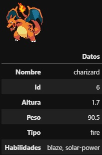

# Pokedex con PokeAPI

    

## 📌Objetivo de la práctica
El objetivo de nuestra práctica es consumir la API (REST) de Pokémon para realizar consultas y extraer información estructurada sobre diversas especies de Pokémon. A través de esta integración, desarrollaremos una Pokédex digital que almacenará y presentará datos relevantes, incluyendo identificadores únicos, nombres, tipos, habilidades, estadísticas base y evoluciones. Para ello, utilizaremos solicitudes HTTP a los endpoints de la API, procesaremos respuestas en formato JSON y aplicaremos técnicas de manipulación de datos para estructurar y visualizar la información de manera eficiente.

Pokedex esperada:

    

## Conceptos básicos
### 💡¿Qué es una API?
Una API (Application Programming Interface, o Interfaz de Programación de Aplicaciones) es un conjunto de reglas y protocolos que permite que diferentes sistemas o aplicaciones se comuniquen entre sí. Funciona como un intermediario que facilita el intercambio de datos y funcionalidades entre software, sin que los usuarios necesiten conocer los detalles internos de su implementación.

Tipos de API
- APIs Web: Son las más comunes y permiten la comunicación entre aplicaciones a través de internet. Usan protocolos como HTTP y formatos de datos como JSON o XML. Ejemplos:

    * RESTful APIs (REST): Basadas en principios REST (Representational State Transfer).
    * SOAP APIs: Usan XML y un protocolo más rígido.
    * GraphQL: Un lenguaje de consulta flexible para APIs.
    * APIs de Sistema: Permiten interactuar con el sistema operativo, como las API de Windows o Linux.
- APIs de Bibliotecas o Frameworks: Ofrecen funciones específicas dentro de un lenguaje de programación, como NumPy en Python o TensorFlow para IA.
- APIs de Hardware: Permiten que el software interactúe con dispositivos físicos, como una API de cámaras o sensores.

### 💡¿Qué es un el protocolo HTTP?
HTTP (Hypertext Transfer Protocol) es un protocolo de comunicación que permite la transferencia de información en la web. Funciona en un modelo cliente-servidor, donde un cliente (como un navegador) envía solicitudes a un servidor, y este responde con los recursos solicitados (como páginas web, imágenes o datos).

- Características clave:
  * Basado en texto: Usa mensajes en formato claro y legible.
  * Sin estado: Cada solicitud es independiente, no guarda información de sesiones (aunque se complementa con cookies y sesiones).
  * 
- Métodos principales:
  * GET → Solicita datos.
  * POST → Envía datos al servidor.
  * PUT → Actualiza recursos.
  * DELETE → Elimina recursos.

## 📦 Descripción de los ficheros
El repositorio cuenta con los siguientes archivos:
- **API_Pokemon.ipynb:** Cuaderno con la práctica
- **Folder imagenes:** Contiene las imágenes usadas dentro del cuaderno

## 🛠️Dependecias para poder realizar la práctica
Para una correcta ejecución de la práctica debe instalar en su entorno las siguinetes librerías:
- pandas

## 🏆 Visualice la práctica
> [!TIP]
> Visualice el cuaderno en nbviewer aquí: [Práctica: PokeAPI](https://nbviewer.org/github/jgcarrillo0/PokeAPI_Practica/blob/main/Cuaderno/API_Pokemon.ipynb)
